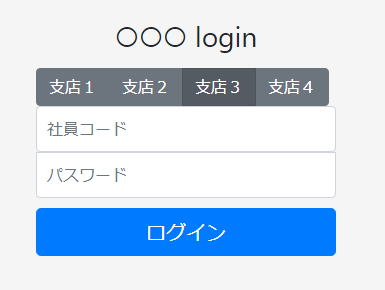
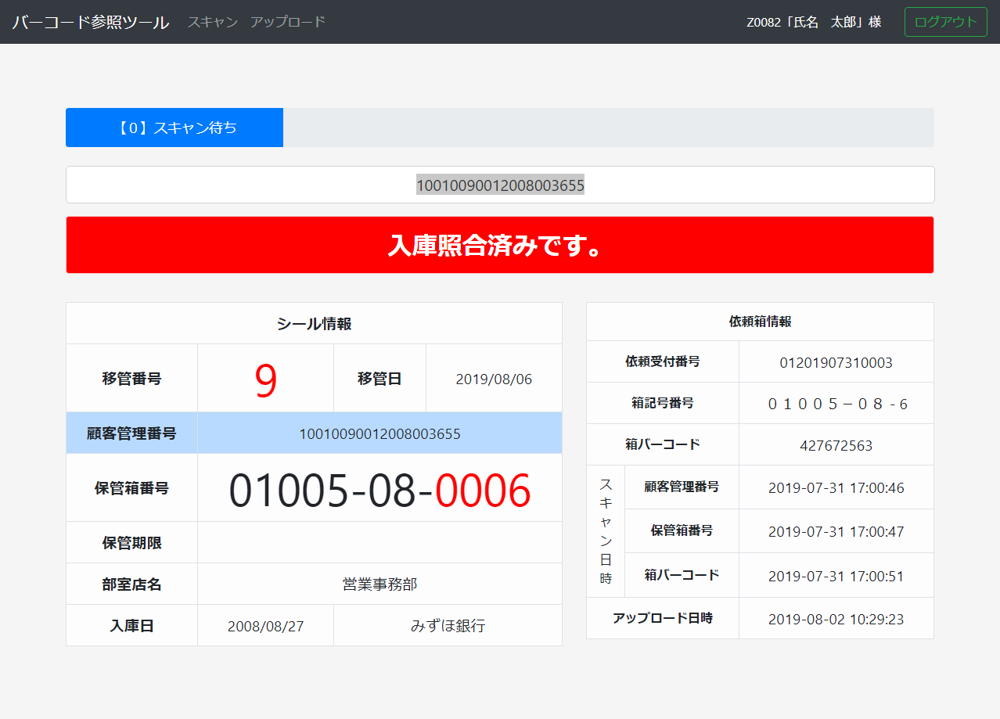
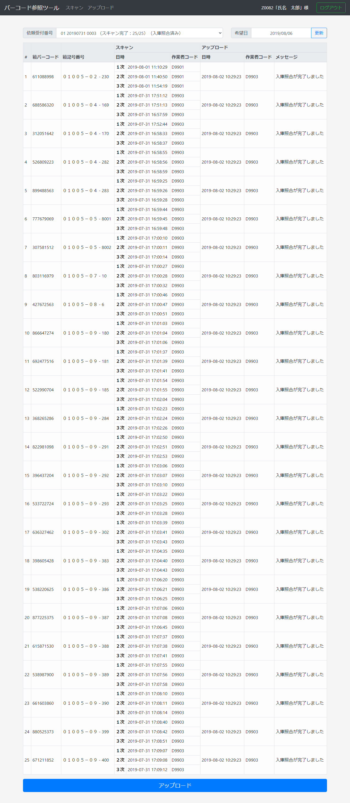

# node barcode processor
2019년에 nodejs로 만든 바코드 처리기입니다. 창고에서의 대량 입고를 위한 임시 작업용으로 만든 것으로, 바코드를 입력해 데이터베이스의 해당 상품의 정보를 확인하거나 입고 확인 상태를 갱신하기 위해서 사용합니다.

## 작성 배경
프로그램 작성 당시의 정보를 밝힐 수 없어 바코드 처리기라는 이름을 붙였습니다. 노트북 PC에 연결한 USB 바코드 리더로 읽은 상품의 바코드가 키가 되어 DB 검색과 수정 등의 작업을 하므로 바코드 처리기라는 이름을 붙였습니다만 엄밀히 말해 nodejs로 만든 검색, 등록, 수정 마이크로 서비스입니다.

한시적으로 필요한 기능이었습니다. 기존에는 없던 특수성이 존재하는 대량 입고 처리를 몇주간에 걸쳐 진행해야 하는데 사용 중인 HT(핸디 터미널)에서 대응할 수 없는 기능이었습니다. 외주인 HT 애플리케이션의 추가 개발을 당장 할 수도 없었으므로 전체 입고를 수작업으로 처리해야 하는 상황이었습니다. 이 상황을 해결하기 위해 이 애플리케이션을 제안했고 약 2주동안 작성을 마쳐 무사히 대량 입고 처리를 할 수 있었습니다.

창고 내의 WIFI를 이용, 바퀴 달린 작은 테이블에 노트북 PC와 바코드 리더를 통해 HT와 같은 역할을 수행했습니다.

## 기능
- 유저 정보 테이블을 이용한 사용자 인증 기능
- 입력한 상품 ID에 해당하는 상세 정보 검색, 표시 기능
- 해당 상품을 포함하는 의뢰 정보의 갱신, 수정

## 스크린샷
로그인 화면



스캔 화면



업로드 화면



## 환경
- node 14
- express
- html, css
- MSSQL

## npm modules
- connect-flash 
- cookie-parser
- cors
- cross-env
- dotenv
- express
- express-session
- helmet
- hpp
- moment
- morgan
- mssql
- passport
- passport-local
- pm2
- pug
- winston
- winston-daily-rotate-file

## 필수 설정 파일
### config/config.js
`config/config.js`에는 데이터베이스 연결 정보와 쿠키 시크릿, 서비스 호스트명을 입력합니다.
```
require('dotenv').config();

module.exports = {
    development: {
        mssql_username: 'username',
        mssql_password: 'password',
        mssql_database: 'database_dev',
        mssql_hostname: 'hostname_dev',
        cookiesecret: 'secret_dev',
        servicehost: 'localhost',
    },
    production: {
        mssql_username: 'username',
        mssql_password: 'password',
        mssql_database: 'database_prod',
        mssql_hostname: 'hostname_prod',
        cookiesecret: 'secret_prod',
        servicehost: 'localhost',
    },
};
```

### .env
```
COOKIE_SECRET=cookiesecret
MSSQL_HOSTNAME=hostname
MSSQL_DATABASE=database
MSSQL_USERNAME=username
MSSQL_PASSWORD=password
```